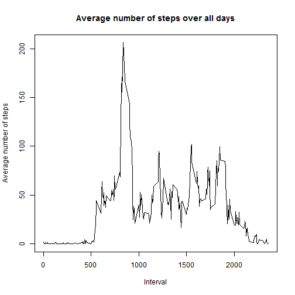

### About
for this project i will read data about personal movement using activity monitoring devices such as a Fitbit, Nike Fuelband, or Jawbone Up and apply statistical methods and software for processing and interpreting the data.

For final result we can see:

1- Loading and preprocessing the data  
2- What is mean total number of steps taken per day?  
3- What is the average daily activity pattern?  
4- Imputing missing values
5- Are there differences in activity patterns between weekdays and weekends?

# load all packages used in this exploratory analysis

```r
render("input.md")
```

```
## Error in eval(expr, envir, enclos): could not find function "render"
```

```r
library(knitr)
library(dplyr)
library(ggplot2)
opts_chunk$set(echo = TRUE)
```

## 1- Loading and preprocessing the data
For this step i will download Data and put dataframe object called "DF"

```r
if(!file.exists("getdata-projectfiles-UCI HAR Dataset.zip")) {
        temp <- tempfile()
        download.file("http://d396qusza40orc.cloudfront.net/repdata%2Fdata%2Factivity.zip",temp)
        unzip(temp)
        unlink(temp)
}

database <- read.table("activity.csv",
               header=TRUE,
               sep=",",
               stringsAsFactors = FALSE,
               colClasses = c("numeric","Date","numeric")
               )
```


## 2- What is mean total number of steps taken per day?
For this part of the assignment, i will ignore the missing values in the dataset and make a histogram of the total number of steps taken each day


```r
TotalStepsByDay <- aggregate(database$steps,list(date=database$date),sum,na.rm=TRUE)
xAxisBreakdown = seq(from=0,to=25000,by=2000) 
hist(TotalStepsByDay$x,
      breaks = xAxisBreakdown,
      main="Frequency of Total Steps per Day",
      col="blue",
      xlab="Steps",
      ylab="Days",
      xaxt="n")
axis(side=1,at=xAxisBreakdown,labels=xAxisBreakdown)
```


The mean and median of the total number of steps taken per day  

```r
stepMean <- mean(TotalStepsByDay$x,na.rm=T)
stepMedian <- median(TotalStepsByDay$x,na.rm=T)
print(paste("The Mean number of steps per day is",round(stepMean,1)))
```

```
## [1] "The Mean number of steps per day is 9354.2"
```

```r
print(paste("The Median number of steps per day is",round(stepMedian,1)))
```

```
## [1] "The Median number of steps per day is 10395"
```

  
   
   
## 3-What is the average daily activity pattern?
Make a time series plot (i.e. type = "l") of the 5-minute interval (x-axis) and the average number of steps taken, averaged across all days (y-axis)


```r
# preprocessing data for plot
steps_by_interval <- aggregate(steps ~ interval, database, mean)

# create a time series plot 
plot(steps_by_interval$interval, steps_by_interval$steps, type='l', 
     main="Average number of steps over all days", xlab="Interval", 
     ylab="Average number of steps")
```



Which 5-minute interval, on average across all the days in the dataset, contains the maximum number of steps? 

```r
# find row with max of steps
max_steps_row <- which.max(steps_by_interval$steps)

# find interval with this max
steps_by_interval[max_steps_row, ]
```

```
##     interval    steps
## 104      835 206.1698
```

## 4-Imputing missing values
Note that there are a number of days/intervals where there are missing values (coded as NA). The presence of missing days may introduce bias into some calculations or summaries of the data.  

Calculate and report the total number of missing values in the dataset (i.e. the total number of rows with NAs)

```r
TotalMV <- sum(is.na(database))
print(paste("Total number of rows with NA's is",round(TotalMV,1)))
```

```
## [1] "Total number of rows with NA's is 2304"
```

I picked the strategy of replacing NA's with the mean for that 5-minute interval.


```r
data_imputed <- database
for (i in 1:nrow(data_imputed)) {
  if (is.na(data_imputed$steps[i])) {
    interval_value <- data_imputed$interval[i]
    steps_value <- steps_by_interval[
      steps_by_interval$interval == interval_value,]
    data_imputed$steps[i] <- steps_value$steps
  }
}
```

I've created new data set data_no_na which equals to database but without NA's. All NA's are replaced with mean of 5-minute interval.  

```r
df_imputed_steps_by_day <- aggregate(steps ~ date, data_imputed, sum)
```

Make a histogram of the total number of steps taken each day and Calculate and report the mean and median total number of steps taken per day. Do these values differ from the estimates from the first part of the assignment? What is the impact of imputing missing data on the estimates of the total daily number of steps?  


```r
hist(df_imputed_steps_by_day$steps, 
     breaks = xAxisBreakdown, 
     main="Histogram of total number of steps per day (imputed)", 
     col="yellow",
     xlab="Total number of steps in a day",
      ylab="Days",
      xaxt="n")
axis(side=1,at=xAxisBreakdown,labels=xAxisBreakdown)
```


```r
# get mean and median of imputed data
mean(df_imputed_steps_by_day$steps)
```

```
## [1] 10766.19
```

```r
median(df_imputed_steps_by_day$steps)
```

```
## [1] 10766.19
```

The mean and median have changed significantly. The stepsImputed variable has 2304 replaced observations (out of 17568); since they're all replaced with means for intervals, day totals will naturally have a much stronger central tendency. Most of the low-step days in Step 2 were due to NA values in the intervals; those days now are essentially equal to the average for all days.
This is not a statistically valid way to fill in missing data, but it fulfills the conditions of this assignment.  

## 5-Are there differences in activity patterns between weekdays and weekends?
Create a new factor variable in the dataset with two levels - "weekday" and "weekend" indicating whether a given date is a weekday or weekend day. obs, my computer by default is in Portuguese so, "sábado"= saturday and "domingo"=sunday


```r
database['type_of_day'] <- weekdays(as.Date(database$date))
database$type_of_day[database$type_of_day  %in% c('sábado','domingo') ] <- "weekend"
database$type_of_day[database$type_of_day != "weekend"] <- "weekday"

# convert type_of_day from character to factor
database$type_of_day <- as.factor(database$type_of_day)
```

Make a panel plot containing a time series plot (i.e. type = "l") of the 5-minute interval (x-axis) and the average number of steps taken, averaged across all weekday days or weekend days (y-axis). See the README file in the GitHub repository to see an example of what this plot should look like using simulated data.

```r
# calculate average steps by interval across all days
df_imputed_steps_by_interval <- aggregate(steps ~ interval + type_of_day, database, mean)

# creat a plot
qplot(interval, 
      steps, 
      data = df_imputed_steps_by_interval, 
      geom=c("line"),
      xlab = "Interval", 
      ylab = "Number of steps", 
      main = "") +
  facet_wrap(~ type_of_day, ncol = 1)
```


